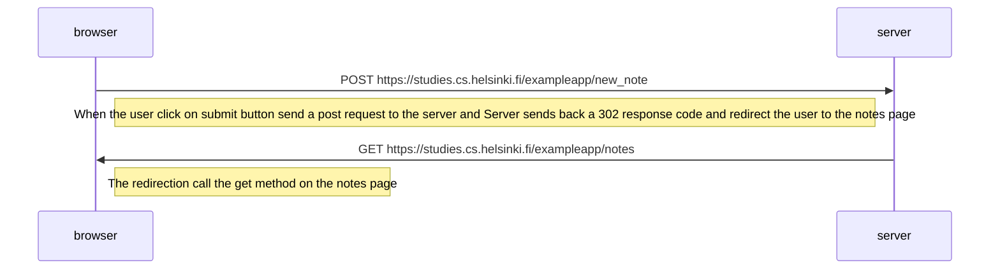

```mermaid
sequenceDiagram
    participant browser
    participant server

    browser->>server: POST https://studies.cs.helsinki.fi/exampleapp/new_note
    Note right of browser: When the user click on submit button send a post request to the server and Server sends back a 302 response code and redirect the user to the notes page
    server->>browser: GET https://studies.cs.helsinki.fi/exampleapp/notes
    Note right of browser: The redirection call the get method on the notes page
```
